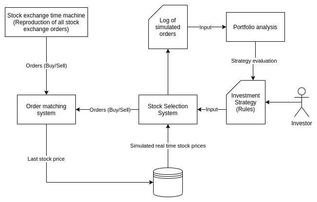

# References

1. [Stock Historical Data](https://github.com/ranaroussi/yfinance)
2. [Similar project](https://medium.com/swlh/build-a-trading-simulator-in-python-ebe046949dd9)
3. [How to build a stock market app](https://agilie.com/en/blog/how-to-build-a-trading-platform-5-things-to-know-before-you-start-a-stock-market-app-like-e-trade)
4. [Design and Architecture of a Trading Platform](https://www.vamsitalkstech.com/?p=315)
5. [Design and Architecture of a Robo-Advisor Platform](https://www.vamsitalkstech.com/?p=2354)
6. [Order matching system](https://en.wikipedia.org/wiki/Order_matching_system)
7. 

# Primitive diagram

<h1 align="center">
   
    
   
</h1>

# Subsystems

## Stock Exchange time machine

This system is responsible for simulating the stock exchange environment over a period of time. The simulation is based on the purchase and sales orders at a given time. Orders must be based on historical data.

## Order Matching system

This system is responsible for receiving and executing purchase and sale orders based on the matching criteria. These criteria must be decoupled from the system, so that several models can be testes to analyze the variation in transaction cost involved.

## Stock Selection System (Minimum Valuable Product)

This system will select the assets to be invested based on the strategy defined by the investor. This system can generate different results based on the analysis of the investor profile. Some of the variables that can affect the result are "exposure to volatity", "favorite sector", "black list of companies", "diversification rate".

### Variables:
- How often will decisions be made?
- Ignored stocks
- Compulsory companies
- Diversification rate
- Exposure to valatity
- Favorite sectors

## Portifolio analysis System

This system will measure the investment strategy. This analysis can evaluate several criteria in addition to the financial return. The strategy "pontuation" is related to whether the results obtained met the criteria defined in the investment strategy. It is necessary to assess wheter the profitability is within the expected, the portifolio's volatility was bellow the defined, and others criterias...
